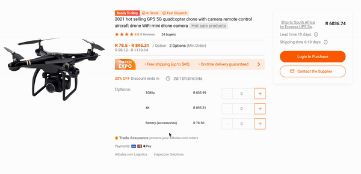

<h3>Hi!
This is single product page project.
</h3>

<h3>This project is hosted on netlify - </h3>

(follow the link below)

<a href='https://stellular-froyo-50cac5.netlify.app'>https://stellular-froyo-50cac5.netlify.app </a>

<h5>To get this project done, I use React JS, SCSS. </h5>

P.S. to run code locally - use 'npm run start' in your terminal or open http://localhost:3000/ in your browser

